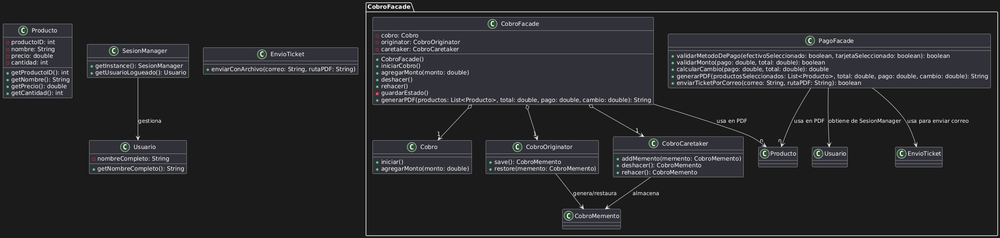
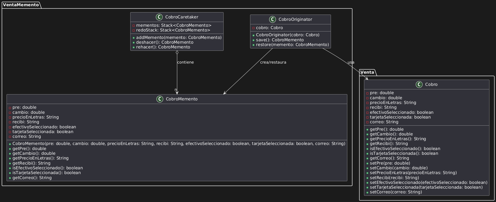
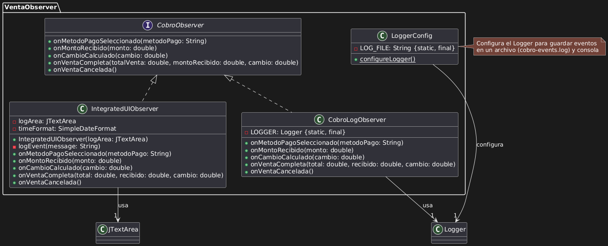
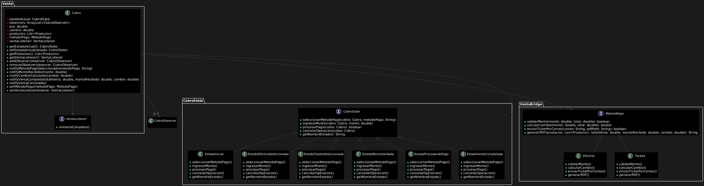

# Introducción a los Patrones de Diseño

Los patrones de diseño son soluciones reutilizables a problemas comunes que surgen durante el desarrollo de software. Su importancia radica en que permiten crear sistemas más flexibles, mantenibles y escalables, facilitando la comunicación entre desarrolladores mediante un lenguaje común.

A continuación se describen algunos de los patrones más relevantes.
El uso adecuado de estos patrones contribuye a la creación de software robusto y fácil de mantener.

# Patrones de Diseño
## Facade
### Implementación del Patrón Facade

#### Descripción del Proyecto

Este proyecto implementa un sistema de cobro para un Punto de Venta (POS) en Java, diseñado para procesar pagos, validar métodos de pago, calcular el cambio, generar tickets en formato PDF y enviarlos por correo electrónico. La versión actual utiliza el patrón de diseño **Facade** para encapsular la lógica compleja y mejorar la modularidad, mantenibilidad y claridad del código.

El sistema interactúa con una interfaz gráfica (Swing) y delega responsabilidades a subsistemas como la generación de PDFs (`iText`) y el envío de correos electrónicos (`EnvioTicket`).

---

#### Estructura del Proyecto

- **Paquete `CobroFacade`**: Contiene la clase `PagoFacade`, que actúa como la fachada principal.
- **Clase `Cobro`**: Interfaz gráfica que interactúa con el usuario y utiliza `PagoFacade` para procesar las operaciones de cobro.
- **Subsistemas**:
  - Generación de tickets PDF (usando `iText`).
  - Envío de correos electrónicos (delegado a `EnvioTicket`).
  - Gestión de sesiones (`SesionManager`).
- **Dependencias**:
  - `iText` para la generación de PDFs.
  - `javax.swing` para la interfaz gráfica.

---

#### Implementación del Patrón Facade

El patrón **Facade** se implementa mediante la clase `PagoFacade`, que proporciona una interfaz simplificada para las siguientes operaciones:
1. **Validación del método de pago** (`validarMetodoDePago`): Verifica si se seleccionó un método de pago (efectivo o tarjeta).
2. **Validación del monto** (`validarMonto`): Comprueba que el monto ingresado sea suficiente para cubrir el total.
3. **Cálculo del cambio** (`calcularCambio`): Calcula el cambio a devolver al cliente.
4. **Generación del ticket PDF** (`generarPDF`): Crea un archivo PDF con los detalles de la venta.
5. **Envío del ticket por correo** (`enviarTicketPorCorreo`): Envía el ticket al correo especificado o permite continuar sin enviarlo.

El cliente (clase `Cobro`) interactúa únicamente con `PagoFacade`, sin necesidad de conocer los detalles internos de los subsistemas.

---

#### Comparación entre la Versión Anterior y la Actual

#### Versión Anterior
En la versión anterior, toda la lógica estaba contenida dentro del método `btnAceptarActionPerformed` y la función `generarPDF` de la clase `Cobro`. Esto generaba los siguientes problemas:

- **Alta cohesión y acoplamiento**: La clase `Cobro` manejaba directamente la validación, el cálculo del cambio, la generación del PDF y el envío por correo, lo que la hacía dependiente de múltiples subsistemas (`iText`, `EnvioTicket`, etc.).
- **Código monolítico**: La lógica estaba mezclada con la interfaz gráfica, dificultando su reutilización y mantenimiento.
- **Falta de modularidad**: Cualquier cambio en la generación del PDF o en el envío del correo requería modificar directamente la clase `Cobro`.
- **Ejemplo de código**:
  ```java
  private void btnAceptarActionPerformed(java.awt.event.ActionEvent evt) {//GEN-FIRST:event_btnAceptarActionPerformed
        // Primero, verifica si algún método de pago ha sido seleccionado.
        if (!efectivo.isSelected() && !tarjeta.isSelected()) {
            JOptionPane.showMessageDialog(this, "Por favor, seleccione un método de pago.");
            return;
        }

        // Intenta procesar el pago y generar/enviar el ticket.
        try {
            double pago = Double.parseDouble(recibi.getText());  // Intenta obtener el pago ingresado.
            if (pago < pre) {
                JOptionPane.showMessageDialog(this, "El monto pagado no es suficiente para cubrir el total de la compra.");
                return;
            }
            cambio = pago - pre;
            camb.setText("$" + String.format("%.2f", cambio));

            // Genera el ticket y obtiene la ruta del PDF generado.
            String pdfPath = generarPDF(productos, pre, pago, cambio);
            if (pdfPath != null) {
                // Verifica si se ha ingresado un correo electrónico.
                String emailDestino = txtCorreo.getText();
                if (emailDestino.isEmpty()) {
                    int opcion = JOptionPane.showConfirmDialog(this, "No ha ingresado un correo electrónico. ¿Desea continuar sin enviar el ticket por correo?", "Correo no ingresado", JOptionPane.YES_NO_OPTION);
                    if (opcion == JOptionPane.NO_OPTION) {
                        return; // Si el usuario selecciona NO, no se procede.
                    }
                } else {
                    EnvioTicket.enviarConArchivo(emailDestino, pdfPath);  // Enviar el PDF por correo
                    JOptionPane.showMessageDialog(this, "El ticket ha sido enviado correctamente a: " + emailDestino);
                }
            } else {
                JOptionPane.showMessageDialog(this, "Error al generar el ticket PDF.");
            }
            
            // Notifica a la ventana Venta que la venta se ha completado
            if (ventaListener != null) {
                ventaListener.onVentaCompleta();
            }

            // Cierra la ventana Cobro
            dispose();

        } catch (NumberFormatException e) {
            JOptionPane.showMessageDialog(this, "Por favor, introduzca un monto válido en el campo 'Recibí'.");
        }
    }//GEN-LAST:event_btnAceptarActionPerformed

    private void jButton4ActionPerformed(java.awt.event.ActionEvent evt) {//GEN-FIRST:event_jButton4ActionPerformed
      dispose();
    }//GEN-LAST:event_jButton4ActionPerformed


    
    private String generarPDF(List<Producto> productosSeleccionados, double total, double pago, double cambio) {
        Document document = new Document();
        String fileName = "Ticket_" + System.currentTimeMillis() + ".pdf";  // Nombre del archivo con marca de tiempo
        String filePath = "./tickets/" + fileName;  // Guardar en un directorio específico
        LocalDateTime fechaActual= LocalDateTime.now();
        DateTimeFormatter formato = DateTimeFormatter.ofPattern("yyyy-MM-dd HH:mm:ss");
        String fechaHoraFormateada = fechaActual.format(formato);

        // Asegúrate de que el directorio tickets existe o créalo
        new File("./tickets").mkdirs();

        try {
            PdfWriter.getInstance(document, new FileOutputStream(filePath));
            document.open();
            
            Usuario usuario = SesionManager.getInstance().getUsuarioLogueado();

            Font bold = FontFactory.getFont(FontFactory.HELVETICA_BOLD, 12);
            Font normal = FontFactory.getFont(FontFactory.HELVETICA, 12);
            Font gigante = FontFactory.getFont(FontFactory.HELVETICA,16);
            
            Paragraph Titulo = new Paragraph("ABARROTES DON LUIS", gigante);
            Titulo.setAlignment(Element.ALIGN_CENTER);
            document.add(Titulo);   
            
            document.add(new Paragraph(""));
            document.add(new Paragraph(""));
            
            document.add(new Paragraph("Ticket de compra",normal));
            document.add(new Paragraph("Cajero: " + usuario.getNombreCompleto()));
            
            document.add(new Paragraph(""));
            document.add(new Paragraph(""));
            
            Paragraph fechaParrafo = new Paragraph("Fecha y Hora: " + fechaHoraFormateada, normal);
            fechaParrafo.setAlignment(Element.ALIGN_RIGHT);
            document.add(fechaParrafo);            
            document.add(new Paragraph(" "));
            document.add(new Paragraph("")); 
            
            document.add(new Paragraph("RFC: VECJ880326", normal));
            document.add(new Paragraph("Régimen fiscal: 601-Ley General de Personas Morales", normal));
            document.add(new Paragraph("Emitido en: Heroica Escuela Naval Militar 917, Reforma Centro, 68050 Oaxaca de Juárez, Oax", normal));
            document.add(new Paragraph(" "));
            document.add(new Paragraph(" "));
            document.add(new Paragraph(" "));
            

            PdfPTable table = new PdfPTable(new float[]{1, 2, 1, 1, 1});
            table.setWidthPercentage(100);
            String[] headers = {"Código", "Producto", "Unidades", "Precio Uni.", "Importe"};
            for (String header : headers) {
                PdfPCell cell = new PdfPCell(new Paragraph(header, bold));
                cell.setBorder(PdfPCell.NO_BORDER);
                table.addCell(cell);
            }

            for (Producto producto : productosSeleccionados) {
                PdfPCell cell = new PdfPCell(new Paragraph(String.valueOf(producto.getProductoID()), normal));
                cell.setBorder(PdfPCell.NO_BORDER);
                table.addCell(cell);
                cell = new PdfPCell(new Paragraph(producto.getNombre(), normal));
                cell.setBorder(PdfPCell.NO_BORDER);
                table.addCell(cell);
                cell = new PdfPCell(new Paragraph(String.valueOf(producto.getCantidad()), normal));
                cell.setBorder(PdfPCell.NO_BORDER);
                table.addCell(cell);
                cell = new PdfPCell(new Paragraph(String.format("$%.2f", producto.getPrecio()), normal));
                cell.setBorder(PdfPCell.NO_BORDER);
                table.addCell(cell);
                cell = new PdfPCell(new Paragraph(String.format("$%.2f", producto.getPrecio() * producto.getCantidad()), normal));
                cell.setBorder(PdfPCell.NO_BORDER);
                table.addCell(cell);
            }

            document.add(table);
            
            
            document.add(new Paragraph(" "));            
            document.add(new Paragraph(" "));
            document.add(new Paragraph(" "));
            
            
            Paragraph totalParrafo = new Paragraph(String.format("Total: $%.2f", total), bold);
            totalParrafo.setAlignment(Element.ALIGN_RIGHT);
            document.add(totalParrafo);

            Paragraph pagoParrafo = new Paragraph(String.format("Pago en efectivo: $%.2f", pago), normal);
            pagoParrafo.setAlignment(Element.ALIGN_RIGHT);
            document.add(pagoParrafo);

            Paragraph cambioParrafo = new Paragraph(String.format("Cambio: $%.2f", cambio), normal);
            cambioParrafo.setAlignment(Element.ALIGN_RIGHT);
            document.add(cambioParrafo);
                        
            document.add(new Paragraph(" "));            
            document.add(new Paragraph(" "));
            document.add(new Paragraph(" "));

            Paragraph graciasParrafo = new Paragraph("¡GRACIAS POR SU COMPRA!", bold);
            graciasParrafo.setAlignment(Element.ALIGN_CENTER);
            document.add(graciasParrafo);
            
            
            document.close();

            if (Desktop.isDesktopSupported()) {
                Desktop.getDesktop().open(new File(filePath));  // Opcional: abrir el archivo automáticamente
            }

            return filePath;
        } catch (Exception e) {
            JOptionPane.showMessageDialog(null, "Error al generar el ticket: " + e.getMessage());
            return null;
        }
    }


#### Versión Actual (con Facade)

La versión actual introduce el patrón Facade mediante la clase `PagoFacade`, resolviendo los problemas anteriores:

- **Encapsulación**: La lógica de validación, cálculo, generación de PDFs y envío de correos se traslada a `PagoFacade`, aislando los subsistemas del cliente (`Cobro`).
- **Bajo acoplamiento**: `Cobro` solo depende de `PagoFacade` y no de los subsistemas subyacentes, como `iText` o `EnvioTicket`.
- **Modularidad y reutilización**: La clase `PagoFacade` puede ser reutilizada en otros contextos del sistema POS sin modificar la interfaz gráfica.
- **Código más limpio**: La lógica del evento `btnAceptarActionPerformed` se reduce a interacciones con `PagoFacade`, mejorando la legibilidad.

**Ejemplo de código actualizado**:

```java
private void btnAceptarActionPerformed(java.awt.event.ActionEvent evt) {
    if (!pagoFacade.validarMetodoDePago(efectivo.isSelected(), tarjeta.isSelected())) {
        return;
    }
    String textoRecibi = recibi.getText().trim();
    if (textoRecibi.isEmpty() || !textoRecibi.matches("\\d+(\\.\\d+)?")) {
        JOptionPane.showMessageDialog(this, "Por favor, introduzca un monto válido.");
        return;
    }
    try {
        double pago = Double.parseDouble(textoRecibi);
        if (!pagoFacade.validarMonto(pago, pre)) {
            return;
        }
        cambio = pagoFacade.calcularCambio(pago, pre);
        camb.setText("$" + String.format("%.2f", cambio));
        String pdfPath = pagoFacade.generarPDF(productos, pre, pago, cambio);
        if (pdfPath != null) {
            boolean flag = pagoFacade.enviarTicketPorCorreo(txtCorreo.getText(), pdfPath);
            if (flag) {
                ventaListener.onVentaCompleta();
                dispose();
            }
        }
    } catch (NumberFormatException e) {
        JOptionPane.showMessageDialog(this, "Por favor, introduzca un monto válido.");
    }
}

```
#### UML Facade



## Memento
### Implementación del Patrón Memento en el Sistema de Cobro

#### Propósito

Este proyecto implementa el patrón de diseño Memento para mejorar la funcionalidad de la clase `Cobro.java` dentro del sistema de tienda de abarrotes. El patrón Memento permite:

1. **Guardar y restaurar estados** durante una transacción de cobro
2. **Implementar funcionalidad de deshacer/rehacer** durante el proceso de cobro
3. **Mantener un historial de transacciones** que puede ser consultado posteriormente
4. **Restaurar transacciones anteriores** en caso de ser necesario

#### ¿Qué es el Patrón Memento?

El patrón Memento es un patrón de diseño de comportamiento que permite:

* Capturar y externalizar el estado interno de un objeto sin violar la encapsulación
* Guardar este estado para poder restaurarlo posteriormente
* Proporcionar una forma de recuperar estados previos sin exponer la implementación interna

El patrón está compuesto por tres elementos principales:
* **Originador**: El objeto cuyo estado se quiere preservar (en este caso, la clase `Cobro`)
* **Memento**: El objeto que almacena el estado interno del originador
* **Caretaker**: El objeto responsable de mantener los mementos

#### Implementación

#### Estructura de Clases

La implementación consta de las siguientes clases:

1. **CobroMemento.java**
   * Almacena el estado de una transacción de cobro
   * Contiene valores como: total, monto recibido, cambio, método de pago, correo, etc.

2. **CobroCaretaker.java**
   * Gestiona los estados del cobro durante una transacción activa
   * Permite operaciones de deshacer (undo) y rehacer (redo)
   * Mantiene un índice del estado actual

3. **Cobro.java (modificado)**
   * Implementa la funcionalidad para guardar y restaurar su estado
   * Incluye nuevos botones para deshacer y rehacer operaciones
   * Integra el patrón Memento con la interfaz de usuario existente

4. **HistorialTransacciones.java**
   * Implementa el patrón Singleton para mantener un historial global de transacciones
   * Almacena transacciones completadas para consulta posterior
   * Permite filtrar transacciones por período de tiempo

5. **InfoTransaccionDialog.java** y **HistorialTransaccionesDialog.java**
   * Proporcionan interfaces de usuario para interactuar con el historial de transacciones
   * Permiten ver detalles y restaurar estados anteriores

#### Cambios Realizados a la Clase Original

La clase `Cobro.java` original ha sido modificada para:

1. Integrar el patrón Memento:
   * Agregar un objeto `CobroCaretaker` para gestionar los estados
   * Implementar métodos para guardar y restaurar estados
   * Añadir botones de interfaz para deshacer/rehacer

2. Mejorar la arquitectura:
   * Mejor separación de responsabilidades
   * Mayor modularidad del código
   * Uso de interfaces para la comunicación entre componentes

3. Añadir funcionalidades:
   * Registro de transacciones en el historial
   * Posibilidad de consultar transacciones pasadas
   * Restaurar estados de transacciones anteriores

#### Comparación con la Versión Original

#### Versión Original

La clase `Cobro.java` original:

* **Limitaciones**:
  * No permitía deshacer/rehacer operaciones durante el proceso de cobro
  * No mantenía un historial de transacciones pasadas
  * No era posible restaurar el estado de una transacción anterior
  * Carecía de una separación clara de responsabilidades

* **Funcionamiento**:
  * Funcionaba como una unidad monolítica
  * El estado del cobro solo existía durante la transacción activa
  * Una vez completada o cancelada la transacción, el estado se perdía permanentemente

#### Versión Mejorada con Memento

La nueva implementación:

* **Ventajas**:
  * Permite navegación completa por el historial de cambios durante una transacción
  * Proporciona persistencia de transacciones pasadas
  * Mejora la experiencia del usuario con capacidades de deshacer/rehacer
  * Facilita la recuperación ante errores de usuario

* **Mejoras de Diseño**:
  * Separación clara de responsabilidades en clases dedicadas
  * Mayor mantenibilidad del código
  * Mejor estructura para pruebas unitarias
  * Fácil ampliación con nuevas funcionalidades

#### Casos de Uso

1. **Durante una transacción activa**:
   * El cajero puede deshacer cambios al introducir montos incorrectos
   * Es posible rehacer operaciones deshechas si fue un error
   * Cada cambio en los campos se guarda automáticamente en el historial

2. **Para transacciones pasadas**:
   * El administrador puede consultar el historial de transacciones
   * Es posible filtrar transacciones por fecha
   * Se pueden ver detalles completos de cada transacción
   * En caso necesario, se puede restaurar el estado de una transacción anterior

#### Instrucciones de Uso

#### Interfaz de Cobro Mejorada

La interfaz de cobro ahora incluye:

* **Botón Deshacer (⟲)**: Restaura el estado anterior del cobro

#### Historial de Transacciones

Para acceder al historial:

1. Abrir el diálogo de historial desde la ventana principal
2. Utilizar los filtros de fecha para encontrar transacciones específicas
3. Hacer doble clic en una transacción para ver sus detalles
4. Si es necesario, usar el botón "Restaurar Estado" para recrear una transacción

#### UML Memento


## Observer

El patrón Observer implementado en el sistema de cobro establece un mecanismo de notificación donde los objetos (observadores) son informados automáticamente sobre cambios de estado en otro objeto (sujeto). Esta implementación permite monitorear en tiempo real el proceso de cobro, tanto para fines de desarrollo como para mejorar la experiencia del usuario final.

### Componentes Principales
#### Interfaz CobroObserver
Se creó la interfaz `CobroObserver` que define los métodos que deben implementar todos los observadores:

``` java
public interface CobroObserver {
    void onMetodoPagoSeleccionado(String metodoPago);
    void onMontoRecibido(double monto);
    void onCambioCalculado(double cambio);
    void onVentaCompleta(double total, double recibido, double cambio);
    void onVentaCancelada();
}
```

#### Clase Sujeto (Cobro)
La clase `Cobro` se modificó para actuar como sujeto observable:
``` java
private ArrayList<CobroObserver> observers = new ArrayList<>();

public void addObserver(CobroObserver observer) {
    observers.add(observer);
}

public void removeObserver(CobroObserver observer) {
    observers.remove(observer);
}
```

#### Métodos de Notificación
Se implementaron métodos específicos en la clase `Cobro` para notificar a los observadores sobre diferentes eventos:
```java
private void notifyMetodoPagoSeleccionado(String metodoPago) {...}
private void notifyMontoRecibido(double monto) {...}
private void notifyCambioCalculado(double cambio) {...}
private void notifyVentaCompleta(double totalVenta, double montoRecibido, double cambio) {...}
private void notifyVentaCancelada() {...}
```

#### Observadores Concretos
Se implementaron dos tipos de observadores:

CobroLogObserver: Registra eventos en el archivo de log
UICobroObserver: Muestra eventos en una ventana gráfica
IntegratedUIObserver: Muestra eventos dentro de la interfaz de cobro

### Sistema de Logging
#### Configuración del Logger
Se creó la clase `LoggerConfig` para configurar el sistema de logging:
``` java
public static void configureLogger() {
    // Crear directorio de logs
    File logDir = new File("logs");
    if (!logDir.exists()) {
        logDir.mkdir();
    }
    
    // Configurar logger
    Logger rootLogger = Logger.getLogger("");
    rootLogger.setLevel(Level.INFO);
    
    // Handlers para consola y archivo
    ConsoleHandler consoleHandler = new ConsoleHandler();
    FileHandler fileHandler = new FileHandler(LOG_FILE, true);
    // ...
}
```

#### Integración de Logging
Los métodos de notificación utilizan el logger para registrar eventos:
``` java
LOGGER.log(Level.INFO, "Notificando método de pago: {0}", metodoPago);
```

### Visualización de Eventos
#### Ventana de Monitoreo
Se implementó una ventana independiente para mostrar los eventos en tiempo real:
``` java
JFrame eventFrame = new JFrame("Monitor de Eventos - Patrón Observer");
JTextArea areaEventos = new JTextArea(15, 40);
areaEventos.setEditable(false);
JScrollPane scrollPane = new JScrollPane(areaEventos);
eventFrame.add(scrollPane);
eventFrame.pack();
eventFrame.setLocation(this.getLocation().x + this.getWidth() + 10, this.getLocation().y);
eventFrame.setVisible(true);

addObserver(new VentaObserver.IntegratedUIObserver(areaEventos));
```

#### Ciclo de Vida de la Ventana
La ventana de monitoreo se cierra automáticamente cuando se cierra la ventana principal:
``` java 
this.addWindowListener(new WindowAdapter() {
    @Override
    public void windowClosing(WindowEvent e) {
        eventFrame.dispose();
    }
    
    public void windowClosed(WindowEvent e) {
        eventFrame.dispose();
    }
});
```

### Registro de Puntos de Observación
Se implementaron puntos de notificación en las siguientes acciones:

#### Selección de Método de Pago
``` java
public void setMetodoPago(MetodoPago metodoPago) {
    this.metodoPago = metodoPago;
    System.out.println("Notificando a " + observers.size() + " observadores sobre método de pago...");
    notifyMetodoPagoSeleccionado(metodoPago.getClass().getSimpleName());
}
```
#### Cálculo de Cambio
``` java
private void calcularCambio() {
    try {
        double montoRecibido = Double.parseDouble(recibi.getText());
        System.out.println("Notificando a " + observers.size() + " observadores sobre método de pago...");
        notifyMontoRecibido(montoRecibido);
        // ...
    }
    // ...
}
```
#### Completar Venta
``` java
if (flag) {
    System.out.println("Notificando a " + observers.size() + " observadores sobre método de pago...");
    notifyVentaCompleta(pago, pago, pago);
    // ...
}
```
#### Cancelar Venta
``` java
private void jButton4ActionPerformed(java.awt.event.ActionEvent evt) {
    System.out.println("Notificando a " + observers.size() + " observadores sobre método de pago...");
    notifyVentaCancelada();
    dispose();
}
```
### Integración en el Sistema

#### Inicialización del Logger
El sistema de logging se inicializa en el constructor de `Cobro` y en el método `main`:
``` java
public Cobro() {
    VentaObserver.LoggerConfig.configureLogger();
    
    File logFile = new File("logs/cobro-events.log");
    if (logFile.exists()) {
        System.out.println("Archivo de log creado en " + logFile.getAbsolutePath());
    } else {
        System.out.println("No se pudo crear el archivo de log.");
    }
    
    // ...
}
```

#### Registro de Observadores
Se registran múltiples observadores en el constructor de Cobro:
``` java
addObserver(new VentaObserver.CobroLogObserver());
addObserver(new VentaObserver.UICobroObserver());
// ...
addObserver(new VentaObserver.IntegratedUIObserver(areaEventos));
```
### Beneficios de la Implementación
Desacoplamiento: Separa la lógica de cobro de la lógica de monitoreo
Extensibilidad: Facilita añadir nuevos tipos de observadores sin modificar la clase `Cobro`
Transparencia: Proporciona visibilidad de los procesos internos, beneficiando tanto a desarrolladores como a usuarios finales
Depuración mejorada: Facilita la detección y resolución de problemas
Auditoría: Proporciona un registro detallado de las operaciones realizadas
### Ubicación de Archivos de Log
Los logs se almacenan en:

Ubicación: `cobro-events.log`
Formato: Texto plano con registros de fecha, hora y mensaje
Persistencia: Mantiene historial entre ejecuciones (append mode)

### Diagrama UML



## State
### Implementación del Patrón State en la Clase Cobro

### ¿Qué es el Patrón State?

El patrón State es un patrón de diseño de comportamiento que permite a un objeto alterar su comportamiento cuando su estado interno cambia. Parecerá como si el objeto cambiara de clase. Este patrón:

1. Encapsula los diferentes comportamientos en clases de estado separadas
2. Delega las solicitudes al objeto de estado actual
3. Permite transiciones entre estados de manera limpia y organizada

### Mejoras aportadas por la implementación del State

#### 1. Organización y claridad del código

**Antes:** La lógica de los diferentes estados (selección de método de pago, validación, procesamiento) estaba mezclada en los métodos de la clase Cobro, haciendo difícil mantener y extender el código.

**Después:** Cada estado tiene su propia clase con responsabilidades claramente definidas, lo que hace el código más legible y mantenible.

#### 2. Manejo consistente de transiciones de estado

**Antes:** Las transiciones entre estados se manejaban con flags y condicionales complejos dentro de los métodos.

**Después:** Cada estado sabe a qué otro estado puede transicionar y bajo qué condiciones, siguiendo el principio de responsabilidad única.

#### 3. Validaciones más robustas

**Antes:** Las validaciones estaban dispersas en diferentes métodos y a veces se repetían.

**Después:** Cada estado maneja sus propias validaciones de manera consistente:
```java
// Ejemplo en EstadoEfectivoSeleccionado
@Override
public void ingresarMonto(Venta.Cobro cobro, double monto) {
    if (monto >= cobro.getPre()) {
        double cambio = monto - cobro.getPre();
        cobro.setCambio(cambio);
        cobro.notifyCambioCalculado(cambio);
        cobro.setEstadoActual(new EstadoMontoValidado());
    } else {
        JOptionPane.showMessageDialog(cobro, "El monto ingresado es insuficiente.");
    }
}
```

#### 4. Comportamiento específico por estado

**Antes:** El comportamiento variaba según flags booleanos (efectivoSeleccionado, tarjetaSeleccionada).

**Después:** Cada estado implementa su propia versión de los métodos:
```java
@Override
public boolean procesarPago(Venta.Cobro cobro) {
    if (cobro.getCorreo().trim().isEmpty()) {
        JOptionPane.showMessageDialog(cobro, 
            "Por favor, ingrese un correo electrónico para enviar el comprobante.");
        return false;
    }
    // ...
}
```

#### 5. Mejor manejo de errores

**Antes:** Los mensajes de error eran genéricos y no siempre contextuales.

**Después:** Cada estado provee mensajes de error específicos:
```java
// En EstadoProcesandoPago
@Override
public void seleccionarMetodoPago(Venta.Cobro cobro, String metodoPago) {
    JOptionPane.showMessageDialog(cobro, 
        "No se puede cambiar el método de pago mientras se procesa la transacción.");
}
```

#### 6. Extensibilidad

**Antes:** Añadir nuevos estados o comportamientos requería modificar la clase Cobro directamente.

**Después:** Se pueden añadir nuevos estados simplemente implementando la interfaz CobroState, sin modificar la clase Cobro:
```java
public class NuevoEstado implements CobroState {
    // Implementación de los métodos requeridos
}
```

#### 7. Mejor integración con otros patrones

El State trabaja bien con:
- **Observer**: Notificando cambios de estado
- **Memento**: Guardando y restaurando estados
- **Facade**: Simplificando interacciones complejas

### Impacto en la Clase Cobro

La clase Cobro ahora:
1. Delega el comportamiento a los objetos de estado
2. Es más simple y enfocada en coordinar las transiciones
3. Tiene una estructura más limpia para añadir nuevos estados
4. Maneja mejor las precondiciones y postcondiciones para cada operación

### Ejemplo de Flujo con State

1. **EstadoInicial**: Esperando selección de método de pago
2. **EstadoEfectivoSeleccionado**: Validando monto recibido
3. **EstadoMontoValidado**: Listo para procesar pago
4. **EstadoProcesandoPago**: Generando ticket y enviando correo
5. **EstadoVentaCompletada**: Operación finalizada

Cada transición es manejada por el estado actual, manteniendo la coherencia en todo el proceso.


### Diagrama UML


# Patrón Adapter

## Estructura del Patrón Adapter

Se implementó el patrón Adapter para desacoplar la lógica de envío de tickets de las implementaciones concretas (correo/WhatsApp).

### Componentes clave:

#### Interfaz ServicioEnvio
Define el contrato para enviar mensajes.

```java
public interface ServicioEnvio {
    void enviar(String destinatario, String asunto, String contenido, String rutaArchivo);
}
```

#### Adaptadores:
- **MandarCorreosAdapter**: Adapta la clase existente MandarCorreos.
- **WhatsAppAdapter**: Integra Twilio para enviar mensajes por WhatsApp.

## Implementación de los Adaptadores

### MandarCorreosAdapter.java

```java
public class MandarCorreosAdapter implements ServicioEnvio {
    private MandarCorreos mandarCorreos = new MandarCorreos();
    
    @Override
    public void enviar(String emailDestino, String asunto, String contenido, String pdfPath) {
        mandarCorreos.enviarArchivo(emailDestino, asunto, contenido, pdfPath);
    }
}
```


### WhatsAppAdapter.java (con Twilio)

```java
public class WhatsAppAdapter implements ServicioEnvio {
    private static final String ACCOUNT_SID = "ACXXXXXXXXXXXXXXXX"; // Credenciales de Twilio
    private static final String AUTH_TOKEN = "tu_auth_token";
    private static final String TWILIO_NUMBER = "whatsapp:+14155238886"; // Número Sandbox
    
    static {
        Twilio.init(ACCOUNT_SID, AUTH_TOKEN); // Inicialización única
    }
    
    @Override
    public void enviar(String numero, String asunto, String contenido, String rutaArchivo) {
        PhoneNumber to = new PhoneNumber("whatsapp:" + numero);
        Message.creator(to, new PhoneNumber(TWILIO_NUMBER), contenido).create();
    }
}
```


## Modificaciones en Cobro.java

- **Inyección de dependencia**: Se añadió un campo ServicioEnvio para usar cualquier adaptador.
- **Selector de método de envío**: Opcionalmente, se puede agregar un JComboBox para elegir entre correo/WhatsApp.

```java
public class Cobro extends JFrame {
    private ServicioEnvio servicioEnvio;
    
    // Constructor modificado
    public Cobro(double total, List<Producto> productos, ServicioEnvio servicioEnvio) {
        this.servicioEnvio = servicioEnvio;
        // ... (código existente)
    }
    
    // Uso del servicio en el botón "Aceptar"
    private void btnAceptarActionPerformed(java.awt.event.ActionEvent evt) {
        servicioEnvio.enviar(destinatario, "Ticket", "Detalles del ticket", pdfPath);
    }
}
```

## Uso en Venta.java

Al crear la ventana Cobro, se elige el adaptador deseado:

```java
// Envío por correo
ServicioEnvio servicioCorreo = new MandarCorreosAdapter();
Cobro cobroCorreo = new Cobro(total, productos, servicioCorreo);

// Envío por WhatsApp
ServicioEnvio servicioWhatsApp = new WhatsAppAdapter();
Cobro cobroWhatsApp = new Cobro(total, productos, servicioWhatsApp);
```

## Diagrama UML


# Patrón Builder en las Clases Producto y Usuario

## Participantes
- **Builder**: `ProductoBuilder`, `UsuarioBuilder`.
- **Productos Construidos**: `Producto`, `Usuario`.

## Finalidad
- Simplificar la creación de objetos complejos con múltiples atributos.
- Permitir configuraciones flexibles (ejemplo: omitir `fechaCaducidad` si no aplica).

## Mejoras Clave
1. **Reducción de Errores**: Evita parámetros incorrectos en constructores largos.
2. **Código Más Limpio**: Métodos como `.precio(20.5)` son autoexplicativos.
3. **Validaciones Centralizadas**: Reglas de negocio en un solo lugar (`build()`).


## UML


## Ejemplo de Uso en el Proyecto
```java
// Crear un producto con Builder
Producto producto = Producto.builder()
    .nombre("Arroz")
    .precio(18.5)
    .marca("Sello Rojo")
    .build();


// Crear un usuario administrador
Usuario usuario = Usuario.builder()
    .nombreUsuario("braulio")
    .email("braulio@tienda.com")
    .rol(Usuario.Rol.GERENTE)
    .build();
```

## Implementación del Patrón Chain of Responsibility en el Módulo de Notificaciones
Objetivo
Refactorizar el sistema de notificaciones (correo electrónico y WhatsApp) utilizando el patrón Chain of Responsibility (CoR) para:

Desacoplar los canales de notificación.
Garantizar que solo un canal procese la solicitud (a menos que falle).
Facilitar la adición de nuevos canales en el futuro.

Cambios Realizados
1. Estructura de Archivos
Se creó un nuevo paquete Venta.notificaciones con las clases:
└── main/
    └── java/
        └── Venta/
            ├── notificaciones/
            │   ├── NotificacionHandler.java   # Handler abstracto
            │   ├── CorreoHandler.java         # Handler para correo
            │   ├── WhatsAppHandler.java       # Handler para WhatsApp
            │   └── NotificacionChain.java     # Constructor de la cadena
            └── Cobro.java                     # Cliente que usa la cadena


3. Clases Clave
NotificacionHandler.java
javaCopiarpublic abstract class NotificacionHandler {
    private NotificacionHandler next;
    
    public NotificacionHandler setNext(NotificacionHandler next) {
        this.next = next;
        return next;
    }

    public void handleRequest(String destinatario, String asunto, String contenido, String archivo) {
        if (next != null) next.handleRequest(destinatario, asunto, contenido, archivo);
    }
}
CorreoHandler.java y WhatsAppHandler.java

Lógica: Intentan enviar la notificación. Si fallan, pasan al siguiente handler.
Cambio crítico: No llaman a super.handleRequest() si tienen éxito.

NotificacionChain.java
javaCopiarpublic class NotificacionChain {
    private NotificacionHandler chain;

    public NotificacionChain() {
        buildChain();
    }

    private void buildChain() {
        this.chain = new CorreoHandler();
        chain.setNext(new WhatsAppHandler()); // Encadenamiento
    }

    public void enviarNotificacion(String destinatario, String asunto, String contenido, String archivo) {
        chain.handleRequest(destinatario, asunto, contenido, archivo);
    }
}


3. Modificaciones en Cobro.java

Se eliminó la inyección directa de ServicioEnvio.
Se integró la cadena de notificaciones:

javaCopiarNotificacionChain notificacionChain = new NotificacionChain();
notificacionChain.enviarNotificacion(emailDestino, "Su Ticket", "Detalles", pdfPath);
UML 


Beneficios Obtenidos

Flexibilidad: Añadir un nuevo canal (ej: SMS) requiere solo crear un nuevo Handler.
Mantenibilidad: Cada handler tiene una única responsabilidad.
Tolerancia a fallos: Si un canal falla, se intenta el siguiente automáticamente.

Pruebas Realizadas
EscenarioResultado EsperadoCorreo exitosoSolo envía correo. No ejecuta WhatsApp.Correo fallaIntenta WhatsApp. Si funciona, se detiene.Ambos fallanEjecuta FallbackHandler (si existe).


# Patrón Mediador

## Descripción
El patrón Mediador es un patrón de comportamiento que define un objeto que encapsula cómo un conjunto de objetos interactúan entre sí. El Mediador promueve el acoplamiento débil al evitar que los objetos se refieran explícitamente entre ellos y permite variar sus interacciones de forma independiente.

## Problema
En nuestra aplicación de gestión de tienda, tenemos varios módulos (inventario, ventas, usuarios, configuraciones, etc.) que necesitan comunicarse entre sí. Sin un mediador, cada componente tendría que conocer a los demás componentes para poder interactuar con ellos, lo que resultaría en:

1. Un alto acoplamiento entre componentes
2. Código difícil de mantener y modificar
3. Dificultad para añadir nuevos componentes o funcionalidades

## Solución
El patrón Mediador resuelve estos problemas centralizando la comunicación entre componentes. En lugar de que cada componente se comunique directamente con otros, todos se comunican a través de un mediador central.

## Estructura del Patrón


## Ventajas

1. **Reduce el acoplamiento**: Los componentes solo conocen al mediador, no a otros componentes.
2. **Centraliza el control**: Las interacciones están concentradas en un solo lugar.
3. **Simplifica la comunicación**: Los componentes no necesitan implementar lógica compleja para comunicarse con otros.
4. **Facilita la extensibilidad**: Es más fácil añadir nuevos componentes al sistema.

## Implementación en nuestra aplicación

En nuestra implementación:

1. La interfaz `Mediador` define los métodos para la comunicación entre componentes.
2. `MediadorConcreto` implementa la lógica de mediación.
3. La interfaz `Componente` define cómo los componentes interactúan con el mediador.
4. Clases como `ComponenteInventario` y `ComponenteVenta` implementan la interfaz Componente.

## Eventos del sistema

Los componentes pueden comunicarse a través de estos eventos:

- `ACTUALIZAR_INVENTARIO`: Notifica sobre cambios en el inventario.
- `NUEVA_VENTA`: Notifica cuando se realiza una venta.
- `ACTUALIZAR_USUARIO`: Notifica sobre cambios en los usuarios.
- `CAMBIO_CONFIGURACION`: Notifica sobre cambios en la configuración.

## Ejemplo de uso

Para utilizar el mediador en el código existente:

```java
// Inicializar el mediador
MediadorConcreto mediador = MediadorConcreto.getInstance();

// Crear componentes
ComponenteInventario inventario = new ComponenteInventario("Principal");
ComponenteVenta venta = new ComponenteVenta("Principal");

// Registrar componentes con el mediador
mediador.registrarComponente(inventario);
mediador.registrarComponente(venta);

// Navegar entre pantallas
mediador.iniciarPantalla("INVENTARIO", usuarioActual);
```


## Ejemplo de ejecucion


## Conclusión

El patrón Mediador nos ayuda a mejorar la organización y mantenibilidad de nuestra aplicación de gestión de tienda, facilitando la comunicación entre componentes de manera desacoplada y centralizada.

# Abstract Factory 

## Introducción

El patrón Abstract Factory (Fábrica Abstracta) es un patrón de diseño creacional que proporciona una interfaz para crear familias de objetos relacionados o dependientes sin especificar sus clases concretas. En otras palabras, este patrón permite la creación de objetos donde la decisión sobre qué tipo concreto de objeto crear se delega a subclases específicas.

## Diagrama UML


## Implementación en el Proyecto

En este proyecto, el patrón Abstract Factory se utiliza para crear diferentes tipos de productos (perecederos y no perecederos) de manera uniforme a través de una interfaz común.

### Componentes Principales

1. **ProductoFactory (Abstract Factory)**: 
   - Define una interfaz abstracta para crear productos.
   - Proporciona un método de fábrica estático `getFactory` que devuelve la fábrica concreta adecuada.
   - Declara el método abstracto `crearProducto` que deben implementar las fábricas concretas.

2. **ProductoPerecederoFactory (Concrete Factory)**:
   - Implementa `crearProducto` para crear productos perecederos con una fecha de caducidad.
   - Incluye un método extendido que permite especificar más detalles específicos.

3. **ProductoNoPerecederoFactory (Concrete Factory)**:
   - Implementa `crearProducto` para crear productos no perecederos sin fecha de caducidad.
   - Incluye un método extendido para detalles adicionales.

4. **Producto (Product)**:
   - Representa el producto creado por las fábricas.
   - Utiliza el patrón Builder para una construcción flexible.

### Flujo de Trabajo

1. El cliente solicita una fábrica específica usando `ProductoFactory.getFactory("tipoProducto")`.
2. La fábrica concreta se utiliza para crear instancias de productos con características específicas.
3. Los productos se crean con configuraciones diferentes según el tipo de fábrica.

## Ventajas del Patrón Abstract Factory en este Proyecto

### 1. Centralización de la Creación de Objetos

La creación de productos está centralizada en las clases de fábrica, lo que permite controlar el proceso de creación desde un solo punto. Esto facilita la gestión y mantenimiento del código, especialmente cuando se trata de un sistema de inventario donde pueden existir diversos tipos de productos.

### 2. Encapsulamiento de la Lógica de Creación

La lógica para crear diferentes tipos de productos está encapsulada en sus respectivas fábricas. Por ejemplo, la lógica para asignar una fecha de caducidad predeterminada a productos perecederos está contenida dentro de `ProductoPerecederoFactory`, lo que facilita la modificación de esta lógica sin afectar al resto del sistema.

### 3. Flexibilidad y Extensibilidad

El diseño permite agregar fácilmente nuevos tipos de productos sin modificar el código existente. Si en el futuro se necesita un nuevo tipo de producto (por ejemplo, "ProductoRefrigerado"), solo se necesita:
- Crear una nueva subclase de `ProductoFactory`
- Actualizar el método `getFactory` para incluir el nuevo tipo

### 4. Consistencia en la Creación de Objetos

Garantiza que los productos creados sigan siempre un patrón consistente. Los productos perecederos siempre tendrán una fecha de caducidad, mientras que los no perecederos nunca la tendrán, evitando errores de configuración.

### 5. Facilita el Testing

La separación clara de responsabilidades facilita las pruebas unitarias. Se pueden probar las fábricas de manera aislada, como se muestra en la clase `Main` creada para este propósito.

### 6. Integración con el Patrón Builder

El proyecto combina eficazmente Abstract Factory con el patrón Builder, lo que proporciona una flexibilidad adicional en la configuración de los objetos producidos.

## Utilidad en el Contexto del Proyecto

En un sistema de gestión de inventario (que parece ser el objetivo de este proyecto), la aplicación del patrón Abstract Factory es particularmente útil por las siguientes razones:

### 1. Diversidad de Productos

Un sistema de inventario maneja diferentes tipos de productos con características distintas. Los productos perecederos requieren seguimiento de fechas de caducidad, mientras que los no perecederos tienen otras consideraciones. El patrón facilita la gestión de esta diversidad.

### 2. Reglas de Negocio Específicas

Cada tipo de producto puede tener reglas de negocio específicas. Por ejemplo, los productos perecederos automáticamente reciben una fecha de caducidad predeterminada. Estas reglas se encapsulan en las fábricas concretas.

### 3. Mantenimiento Simplificado

Cuando las reglas de negocio cambian (por ejemplo, si cambia el período predeterminado de caducidad), solo es necesario modificar la fábrica concreta correspondiente, sin afectar al resto del sistema.

### 4. Interfaz Unificada

Proporciona una interfaz unificada para la creación de productos, lo que simplifica el código cliente. El código que necesita crear productos no necesita conocer los detalles específicos de cada tipo.

## Conclusión

La implementación del patrón Abstract Factory en este proyecto proporciona una solución elegante y extensible para la creación de diferentes tipos de productos. Combinado con el patrón Builder, ofrece una gran flexibilidad mientras mantiene la simplicidad en el uso.

Este diseño facilita la evolución del sistema a medida que surgen nuevos requisitos, permitiendo que el código sea más mantenible y menos propenso a errores relacionados con la creación y configuración de objetos.

