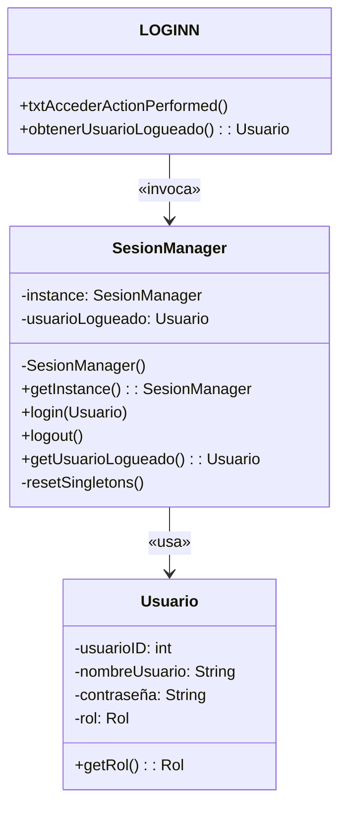
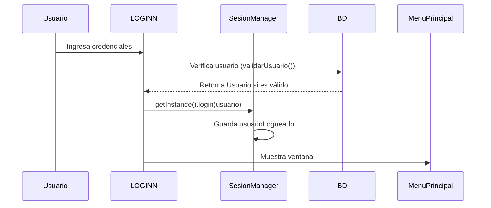
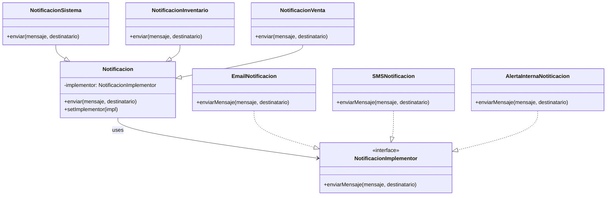
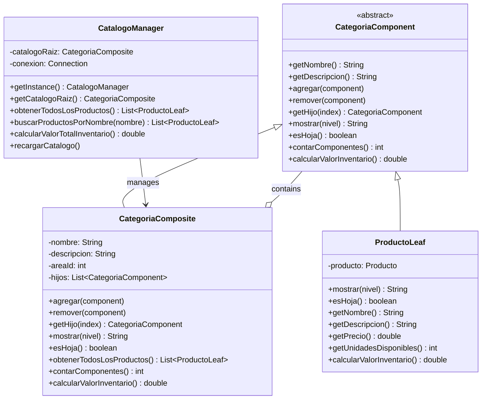

Patron Singleton 

## 🖥️ Diagramas Técnicos  

### 1. Diagrama UML (Mermaid)  

### 2. Flujo de Autenticación (Sequence Diagram)  

## Pruebas de funcionamiento 
**Aqui podemos ver la conexion existosa en la base de datos  **  `clase Conexion_DB` y `LOGINN` 

**Aqui podemos ver como solo existe un inicio de session  **   `LOGINN` 

# Patrón Bridge (Puente)

## 📋 Definición

El **Patrón Bridge** es un patrón de diseño estructural que separa una abstracción de su implementación, permitiendo que ambas puedan variar independientemente. Su propósito principal es desacoplar una abstracción de su implementación para que las dos puedan evolucionar por separado.

## 🎯 Propósito

- **Desacoplar** la abstracción de la implementación
- Permitir que ambas puedan **variar independientemente**
- Evitar la **explosión combinatoria** de clases
- Compartir implementaciones entre múltiples objetos

## 🔧 Cuándo Usar

✅ **Usa Bridge cuando:**
- Quieres evitar un enlace permanente entre una abstracción y su implementación
- Necesitas que tanto las abstracciones como las implementaciones sean extensibles mediante herencia
- Quieres ocultar completamente la implementación de los clientes
- Tienes una proliferación de clases (explosión combinatoria)

## 📊 Diagrama de Clases - Bridge

## 🖼️ Funcionamiento del Patrón Bridge

### Imagen: Interfaz Principal del Sistema de Notificaciones

**Descripción**: La interfaz permite seleccionar el tipo de notificación (Sistema, Inventario, Venta) y el medio de envío (Email, SMS, Alerta Interna). El patrón Bridge permite que cualquier tipo de notificación pueda enviarse por cualquier medio de forma independiente.

### Imagen: Selección de Tipo de Notificación

**Descripción**: El usuario puede elegir entre diferentes abstracciones (NotificacionSistema, NotificacionInventario, NotificacionVenta), cada una con su formato y características específicas, pero todas usando la misma interfaz de implementación.

### Imagen: Selección de Medio de Envío

**Descripción**: Independientemente del tipo de notificación seleccionado, el usuario puede elegir cualquier medio de envío. Esta flexibilidad es posible gracias al patrón Bridge que desacopla la abstracción de la implementación.

### Imagen: Resultado del Envío

**Descripción**: El mensaje se envía con el formato correspondiente al tipo de notificación y utilizando el medio seleccionado. Por ejemplo, una NotificacionInventario por Email mostrará "[INVENTARIO]" como prefijo y se enviará usando la implementación de correo electrónico.

---

# Patrón Composite (Compuesto)

## 📋 Definición

El **Patrón Composite** es un patrón de diseño estructural que permite componer objetos en estructuras de árbol para representar jerarquías parte-todo. Composite permite a los clientes tratar de manera uniforme tanto a los objetos individuales como a las composiciones de objetos.

## 🎯 Propósito

- **Representar jerarquías** parte-todo de objetos
- Tratar **uniformemente** objetos individuales y composiciones
- Simplificar el código cliente mediante una **interfaz común**
- Facilitar la **adición de nuevos tipos** de componentes

## 🔧 Cuándo Usar

✅ **Usa Composite cuando:**
- Quieres representar jerarquías parte-todo de objetos
- Quieres que los clientes ignoren la diferencia entre composiciones de objetos y objetos individuales
- La estructura puede representarse como un árbol
- Necesitas aplicar las mismas operaciones sobre objetos individuales y compuestos

## 📊 Diagrama de Clases - Composite

## 🖼️ Funcionamiento del Patrón Composite

### Imagen: Interfaz Principal del Catálogo

**Descripción**: La interfaz muestra una estructura jerárquica en forma de árbol donde las categorías (nodos compuestos) pueden contener productos (hojas) y subcategorías. El patrón Composite permite tratar tanto categorías como productos de manera uniforme.

### Imagen: Árbol de Categorías Expandido

**Descripción**: Al expandir el árbol, se pueden ver las categorías principales (Lácteos, Carnes, Bebidas, etc.) que actúan como nodos compuestos, cada una conteniendo productos individuales que actúan como hojas. La estructura refleja la organización jerárquica del inventario.

### Imagen: Selección de Categoría

**Descripción**: Al seleccionar una categoría en el árbol, se muestran todos los productos que contiene en el panel central. El patrón Composite permite obtener todos los productos de una categoría de manera recursiva, tratando uniformemente tanto los productos individuales como las subcategorías.

### Imagen: Búsqueda de Productos

**Descripción**: La funcionalidad de búsqueda utiliza el patrón Composite para recorrer toda la jerarquía de categorías y productos, permitiendo encontrar productos sin importar en qué nivel de la estructura se encuentren.

### Imagen: Cálculo de Valor Total

**Descripción**: El sistema calcula el valor total del inventario utilizando el patrón Composite. Las categorías (compuestos) suman el valor de todos sus productos e hijos, mientras que los productos (hojas) devuelven su valor individual. Esta operación se realiza de manera recursiva en toda la jerarquía.

---

# Implementación en el Proyecto

## 🏪 Sistema de Tienda de Abarrotes

### Patrón Bridge - Sistema de Notificaciones
- **Abstracciones**: Diferentes tipos de notificaciones del sistema
- **Implementadores**: Diferentes medios de envío de mensajes
- **Beneficio**: Flexibilidad para combinar cualquier tipo de notificación con cualquier medio de envío

### Patrón Composite - Catálogo de Productos
- **Compuestos**: Categorías de productos que pueden contener subcategorías y productos
- **Hojas**: Productos individuales del inventario
- **Beneficio**: Organización jerárquica del inventario con operaciones uniformes

