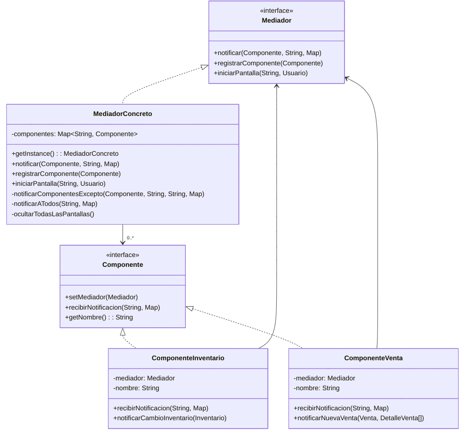

# Patrón Mediador

## Descripción
El patrón Mediador es un patrón de comportamiento que define un objeto que encapsula cómo un conjunto de objetos interactúan entre sí. El Mediador promueve el acoplamiento débil al evitar que los objetos se refieran explícitamente entre ellos y permite variar sus interacciones de forma independiente.

## Problema
En nuestra aplicación de gestión de tienda, tenemos varios módulos (inventario, ventas, usuarios, configuraciones, etc.) que necesitan comunicarse entre sí. Sin un mediador, cada componente tendría que conocer a los demás componentes para poder interactuar con ellos, lo que resultaría en:

1. Un alto acoplamiento entre componentes
2. Código difícil de mantener y modificar
3. Dificultad para añadir nuevos componentes o funcionalidades

## Solución
El patrón Mediador resuelve estos problemas centralizando la comunicación entre componentes. En lugar de que cada componente se comunique directamente con otros, todos se comunican a través de un mediador central.

## Estructura del Patrón



## Ventajas

1. **Reduce el acoplamiento**: Los componentes solo conocen al mediador, no a otros componentes.
2. **Centraliza el control**: Las interacciones están concentradas en un solo lugar.
3. **Simplifica la comunicación**: Los componentes no necesitan implementar lógica compleja para comunicarse con otros.
4. **Facilita la extensibilidad**: Es más fácil añadir nuevos componentes al sistema.

## Implementación en nuestra aplicación

En nuestra implementación:

1. La interfaz `Mediador` define los métodos para la comunicación entre componentes.
2. `MediadorConcreto` implementa la lógica de mediación.
3. La interfaz `Componente` define cómo los componentes interactúan con el mediador.
4. Clases como `ComponenteInventario` y `ComponenteVenta` implementan la interfaz Componente.

## Eventos del sistema

Los componentes pueden comunicarse a través de estos eventos:

- `ACTUALIZAR_INVENTARIO`: Notifica sobre cambios en el inventario.
- `NUEVA_VENTA`: Notifica cuando se realiza una venta.
- `ACTUALIZAR_USUARIO`: Notifica sobre cambios en los usuarios.
- `CAMBIO_CONFIGURACION`: Notifica sobre cambios en la configuración.

## Ejemplo de uso

Para utilizar el mediador en el código existente:

```java
// Inicializar el mediador
MediadorConcreto mediador = MediadorConcreto.getInstance();

// Crear componentes
ComponenteInventario inventario = new ComponenteInventario("Principal");
ComponenteVenta venta = new ComponenteVenta("Principal");

// Registrar componentes con el mediador
mediador.registrarComponente(inventario);
mediador.registrarComponente(venta);

// Navegar entre pantallas
mediador.iniciarPantalla("INVENTARIO", usuarioActual);
```

## Conclusión

El patrón Mediador nos ayuda a mejorar la organización y mantenibilidad de nuestra aplicación de gestión de tienda, facilitando la comunicación entre componentes de manera desacoplada y centralizada.
